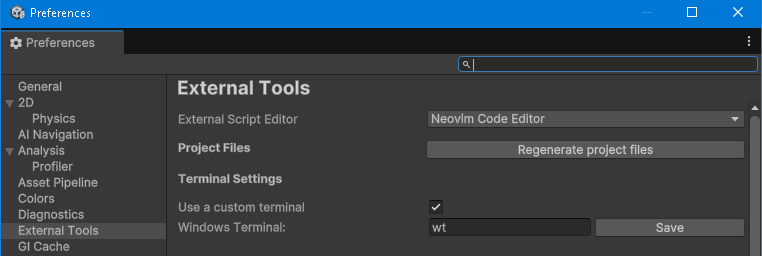

# NvimUnity

This Unity package integrates Neovim as an external script editor and provides a **Regenerate Project Files** button inside the Unity Editor.


## 🧩 Features

- 🧠 Automatically open C# scripts in Neovim when clicked in Unity
- 🖥️ Opens all files from the same Unity project in the **same terminal and buffer**
- 🔄 Regenerate `.csproj` files via a Unity button
- 🔌 Unity package + Neovim plugin architecture
- 🔥 Zero dependency on `nvr` (Neovim Remote)
- 🖥️ Cross-platform support (Windows, Linux, macOS)


## 📂 Installation

### Unity

1. Install the Unity package from Git:

```json
https://github.com/apyra/nvim-unity.git
```
2. Unity will auto-detect the editor as **"Neovim Code Editor"** in `External Tools`:

- Go to `Edit > Preferences > External Tools`
- Select **Neovim Code Editor** (no need to browse for `.exe`)


### Neovim (Lua)

### 🔁 File Sync with [nvim-unity-sync](https://github.com/apyra/nvim-unity-sync)

This plugin keeps your `.csproj` updated when creating/renaming/deleting `.cs` files in nvim even if Unity is closed:

```lua
{
  "apyra/nvim-unity-sync",
  lazy = false,
  config = function()
    require("unity.plugin").setup()
  end,
}
```

## Usage

### Open Files from Unity
- Click in a `.cs` file in Unity and it will open in Neovim, simple like that.
- All files from the same project share a terminal.

### Regenerate Project Files
- From Unity: `Preferences > External Tools > Regenerate Project Files`
- From Tools Menu: `Tools > Neovim Code Editor > Regenerate Project Files`

### Custom Terminal

*If you want to run nvim from a custom terminal you can set it here. In windows for example if you run nvim directly, it may not showup very well because the current user will not be bound to it.




## 🧠 Recommended Configuration

- [Neovim](https://neovim.io/) *(required)*
- [NvChad](https://nvchad.com/) as your Neovim base, with:
  - LSP  
  - Lazy.nvim  
  - Mason.nvim  
  - Telescope  
  - GitSigns  
  - Tabs for multi-file editing


### 🔧 LSP Setup for C#

Install `omnisharp` using [mason.nvim](https://github.com/williamboman/mason.nvim), it requires .Net installed.

```lua
local lspconfig = require("lspconfig")
lspconfig.omnisharp.setup {
  on_attach = nvlsp.on_attach,
  capabilities = nvlsp.capabilities,
  cmd = {
    "dotnet",
    vim.fn.stdpath "data" .. "\\mason\\packages\\omnisharp\\libexec\\OmniSharp.dll",
  },
  settings = {
    FormattingOptions = {
      EnableEditorConfigSupport = false,
      OrganizeImports = true,
    },
    Sdk = {
      IncludePrereleases = true,
    },
  },
}
```

> ⚠️ Omnisharp requires `.csproj` and `.sln` in the root folder — make sure to use "Regenerate Project Files" if missing. *It may take a second or two to attach into your working buffer.


### 🌲 Treesitter Setup 

```lua
{
  "nvim-treesitter/nvim-treesitter",
  opts = {
    ensure_installed = {
      "c_sharp",
    },
  },
}
```

Then run `:TSInstall` in Neovim.


### 🤖 Copilot (Optional)

```lua
{
  "github/copilot.vim",
  lazy = false,
  config = function()
    vim.g.copilot_no_tab_map = true
    vim.g.copilot_assume_mapped = true
  end,
}
```

In `mappings.lua` (NvChad):

```lua
map("i", "<C-l>", function()
  vim.fn.feedkeys(vim.fn["copilot#Accept"](), "")
end, { desc = "Copilot Accept", noremap = true, silent = true })
```

### 🧬 Vim Fugitive for Git (Optional)

```lua
use {
  'tpope/vim-fugitive',
  config = function()
    -- Optional config
  end
}
```

### 📁 Folding with [nvim-ufo](https://github.com/kevinhwang91/nvim-ufo) (Optional)

```lua
{
  "kevinhwang91/nvim-ufo",
  -- your config here
}
```

## 🧩 Unity Snippets

Use [LuaSnip](https://github.com/L3MON4D3/LuaSnip) to insert Unity C# boilerplate.

### ✍️ Snippet Setup

**Linux/macOS:**

```
~/.config/nvim/lua/snippets/cs.lua
```

**Windows:**

```
C:/Users/YOUR_USERNAME/AppData/Local/nvim/lua/snippets/cs.lua
```

### 🔌 Load Snippets

**Linux/macOS:**

```lua
require("luasnip.loaders.from_lua").load({ paths = "~/.config/nvim/lua/snippets" })
```

**Windows:**

```lua
require("luasnip.loaders.from_lua").lazy_load({
  paths = vim.fn.stdpath("config") .. "/lua/snippets"
})
```

### 🧾 Example Snippets

```lua
-- cs.lua
local ls = require("luasnip")
local s, t, i = ls.snippet, ls.text_node, ls.insert_node

return {
  s("start", { t("void Start() {"), t({"", "    "}), i(1), t({"", "}"}) }),
  s("update", { t("void Update() {"), t({"", "    "}), i(1), t({"", "}"}) }),
  s("awake", { t("void Awake() {"), t({"", "    "}), i(1), t({"", "}"}) }),
  s("fixedupdate", { t("void FixedUpdate() {"), t({"", "    "}), i(1), t({"", "}"}) }),
  s("onenable", { t("void OnEnable() {"), t({"", "    "}), i(1), t({"", "}"}) }),
  s("ondisable", { t("void OnDisable() {"), t({"", "    "}), i(1), t({"", "}"}) }),
  s("ontriggerenter", { t("void OnTriggerEnter(Collider other) {"), t({"", "    "}), i(1), t({"", "}"}) }),
  s("oncollisionenter", { t("void OnCollisionEnter(Collision collision) {"), t({"", "    "}), i(1), t({"", "}"}) }),
  s("serializefield", { t("[SerializeField] private "), i(1, "Type"), t(" "), i(2, "variableName"), t(";") }),
  s("publicfield", { t("public "), i(1, "Type"), t(" "), i(2, "variableName"), t(";") }),
  s("log", { t('Debug.Log("'), i(1, "message"), t('");') }),
  s("class", {
    t("using UnityEngine;"), t({"", ""}),
    t("public class "), i(1, "ClassName"), t(" : MonoBehaviour"),
    t({"", "{"}),
    t({"", "    "}), i(2, "// Your code here"),
    t({"", "}"}),
  }),
}
```

## ⚡ Final Note

Neovim is a blazing-fast editor. With NvChad + LSP + this Unity integration, it becomes a powerful Unity dev environment.

## 🧑 Contributing

PRs, issues, ideas welcome! This project is evolving – help shape it 🚀

## 📄 License

MIT
